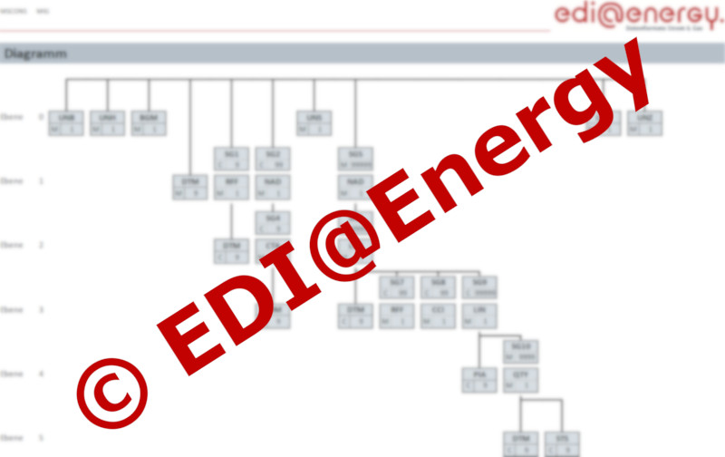

## Segment Group Hierarchies

The segment group hierarchies are handcrafted information about the structure of an EDIFACT format.

The information is derived/read from the format diagrams at the beginning of each MIG file:

Because we're unsure about the copyright, this is just an unreadable screenshot from the [FV2204 MSCONS MIG](https://www.edi-energy.de/index.php?id=38&tx_bdew_bdew%5Buid%5D=1318&tx_bdew_bdew%5Baction%5D=download&tx_bdew_bdew%5Bcontroller%5D=Dokument&cHash=e923f08c68b6db9d1ff927c5855a37ce) but the idea should be clear.
